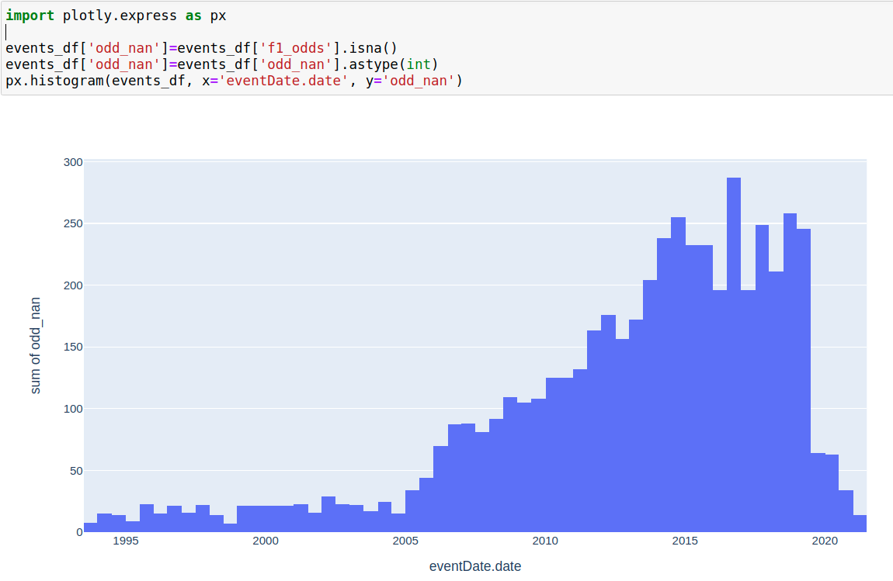

1) Гистограмма пустых значений кэфов. Откуда берутся наны?
import plotly.express as px

events_df['odd_nan']=events_df['f1_odds'].isna()
events_df['odd_nan']=events_df['odd_nan'].astype(int)
px.histogram(events_df, x='eventDate.date', y='odd_nan')

   

2)
TODO - change weight category to average weight
And then get the difference between average weight and fighter weight
Находим все возможные весовые категории
avg_weight_in_weight_category = fighters_df.groupby(by="weightCategory.id").mean()['weight']
avg_weight_in_weight_category

3) Loose methods
4) 
- Average opp age
- Average winner opp age
- Average loser opp age

5) Carier started at age - когда начал карьеру в юфс
Ср.количество боев в год
Количество дней со дня последнего боя

6) Динамика статистики - кэфы регрессии